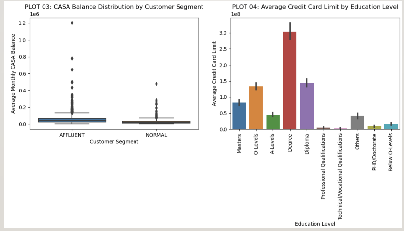

# 1. INTRODUCTION

## Business Problem and Project Objectives
- Business Problem
    - The bank aims to expand its customer base across different segments, particularly focusing on upselling (selling more expensive or premium products) or cross-selling (selling additional products) to existing customers.
    - A critical part of this strategy involves upgrading certain customers from the “NORMAL” segment to the “AFFLUENT” segment. 
    - The underlying assumption is that customers in the “AFFLUENT” segments are more likely to be interested in, and can afford, a broader range of banking products and services, especially those that are more premium or specialized. 
    - This customer segment upgrade is seen as a pathway to increasing bank revenue.
- Project Objectives
    - As a senior data scientist, the main objective is to identify existing cutomers (“ETB” or Existing To Bank customers) who, despite being classified under the “NORMAL” segment, exhibit characteristics or behaviors that align with those typically associated with “AFFLUENT” customers.
    - These are the “hidden AFFLUENT customers” the bank aims to target for segement upgrade promotions. Identifying these customers involves analyzing customer data to uncover patterns or indicators of affluence not immediately apparent through their current segment classification.
- To achieve said objectives, the project involves several key tasks which will be discussed in more in-depth in this slide deck.
    - **Data Analysis & Feature Selection:** Analyzing the bank’s customer data to understand the behaviors, characteristics, and patterns that differentiate “NORMAL” from “AFFLUENT” customers. This involves selecting features (e.g., account balances, transaction volumes, product holdings) that might indicate a higher propensity for being “AFFLUENT”.
    - **Predictive Modelling:** Developing a machine learning model that can predict the likelihood a “NORMAL” segment customer being a “hidden AFFLUENT” customer based on their banking behaviors and characteristics.
    - **Segmentation Strategy:** Proposing a strategy for how the bank can approach these identified customers to upgrade their segment. This includes recommendation for personalized marketing, product offerings, and any incentives that could motivate customers to upgrade. 
    - **Evaluation and Implementation:** Setting up metrics for evaluating the success of the model in accurately identifying AFFLUENT customers and the effectiveness of the upgrade strategy. Implementing the model and strategy in s away that allows for tracking and continuous improvement.

---

# 2. EXPLORATORY DATA ANALYSIS (EDA)

## Data Semantic: Overview
- The dataset contains banking and financial information of existing bank customers in 5.60 MB-sized Microsoft ExCel file, consisting 66083 customers with 30 feature information, including a binary target feature called `C_seg` that reflects”NORMAL” or “AFFLUENT” customer segmentation.

## Data Semantic: Numerical and Categorical Features
- List of Numerical Features:
    - `C_AGE`, `INCM_TYP`, `NUM_PRD, `CASATD_CNT`, `MTHCASA`,
    - `MAXCASA`, `MINCASA`, `DRvCR`, `MTHTD`, `MAXTD`, `Asset value`,
    - `UT_AVE`, `MAXUT`, `N_FUNDS`, `CC_AVE`, `CC_LMT`
- List of Categorical Features:
    - `C_EDU`, `C_HSE`, `gn_occ`
    - `C_seg`

## Data Semantic: Candidate Keys
- We need to find a set of features (called as “candidate keys”) that can uniquely identify a customer’s feature tuple or also known as ”records” in database warehousing field.
- This is important not only for easiness of sorting, but it also plays a role as identifying real customers from synthetically-generated customers in later part of this presentation which is done to combat data imbalance.
- From data exploration, it’s concluded that there is no ideal candidate keys. Having said that, we can form best-effort candidate keys based on `C_ID`, `C_AGE`, and `PC`.
- Further investigation reveals that `PC` has missing data. 
    - For rows with non-missing `PC`, combination of said 3 features only gives 16 non-unique rows (see next slide) out of total 66083 rows which is good enough. These 16 non-unique rows come from 8 tuples (see next slide) of `C_ID`, `C_AGE`, and `PC`. 
    - For rows with missing `PC`, combination of `C_ID` and `C_AGE` alone can uniquely identify them. This in turn means that missing rows in `PC` can be imputed by any arbitrary new number and they will still be unique records based on candidate keys `C_ID`, `C_AGE`, and `PC`

## Data Semantic: Presence of Missing Data
- Missing data are detected in multiple features as can be seen in the column list on the right snippet.
- There are few features that have complete data for all 66083 customers:
    - `C_ID`, `C_AGE`, `NUM_PRD`, `Asset value`

## Descriptive Statistics (Grouped by `C_seg`)
- For each feature, descriptive statistics are analyzed based on grouping by `C_seg`. 
- This allows us to gauge the data distribution of each feature with respect to different customer segments.
- The descriptive statistics include number of observations (count), measures of central tendency (mean, median), measures of variability of spread (std, min, max), and quantile intervals for data distribution (25%, 50%, 75%).
- Insights are summarized in slide 17. 

## Visualizations for Insight Gathering

PLOT 07: Pair Plot for Selected Numerical Variables

## Summary of EDA and Derived Action Items

- There are 66803 rows and 30 columns.
    - [ACTION-ITEM] We will explore the possibility of dimensionality reduction using PCA algorithm during **Data Processing Techniques** section and compare the evaluation metrics between full and reduced feature in **Model Training & Evaluation section**.
- There are 3 features with int64 data type (`C_ID`, `C_AGE`, `NUM_PRD`), 4 features with string data type (`C_EDU`, `C_HSE`, `gn_occ`, and `C_seg`), and remaining 23 features are of float64 data type. 
    - [ACTION-ITEM] All features with string data type will be converted into one-hot categorical data type in **Data Processing Techniques** section.
    - The only exception would be for column `C_seg` where it would be mapped to single integer value that varies for different customer segment.
- There are 5 features with no missing values at all, namely, `C_ID`, `C_AGE`, `NUM_PRD`, `Asset value`, `C_seg`
- There are 25 features with at least 1 row of missing value. 
    - [ACTION-ITEM] These 25 features will be imputed in **Data Processing Techniques**.
- We can use `C_ID`, `C_AGE`, and `PC` columns as best-effort candidate keys:
    - Out of 66083 rows, there are 456 missing data on `PC`
    - For these 456 rows with missing data of `PC`, `C_ID` and `C_AGE` rows are unique which means that if we were to substitute a new arbitrary number into these 456 rows of `PC`, they can still be come unique.
    - Previously, I mentioned that the 3 columns are best-effort unique key identifiers. This is because for remaining 65627 rows with non-missing data of `PC`, there are only 8 duplicated tuples which is sufficiently good.
- Based on visualization plots and the descriptive statistics of dataset on non-categorical features between NORMAL and AFFLUENT customer segments, here are the insights:
    - Number of Obsevations:
        - Count: The NORMAL customers generally exhibits higher counts across all columns than the AFFLUENT segment, suggesting a larger sample size for the NORMAL group.
    - Measures of Central Tendency:
        - Mean: On average, the NORMAL customers tends to exhibit lower mean values across various metrics compared to the AFFLUENT customers indicating higher wealth in the AFFLUENT group. However, there are exceptions where the NORMAL customers’ mean is higher, indicating variability in these metrics.
        - Median: The 50th percentile (median) values further support that the AFFLUENT customers often has higher central values, reinforcing the notion of greater wealth within this group.
    - Measures of Variability or Spread:
        - Std: Standard deviations vary between the segments and across columns, with the AFFLUENT customers sometimes showing more variability or a wider range of values, indicating a diverse wealth distribution.
        - Min: The minimum values for some metrics start from a similar baseline across segments. However, for other metrics, the AFFLUENT segment exhibits higher minimum values, suggesting a higher baseline of wealth.
        - Max: Maximum values frequently indicate that the AFFLUENT customers has a significant presence of very high values, showcasing the extreme wealth within this group.
    - Quantile Intervals for Data Distribution:
        - 25%, 50%, 75%: Higher quartile values in the AFFLUENT customers across most metrics suggest that a larger proportion of this group possesses higher values. This is especially notable in the median (50th percentile) comparisons, highlighting the central tendency of each segment, with AFFLUENT typically being higher.
    - [ACTION-ITEM] There are 55157 NORMAL customers and 10926 AFFLUENT customers. We will explore the possibility of data augmentation to combat data imbalance.
    - [ACTION-ITEM] We need to perform standard scaling or normalization to center the distribution of non-categorical features.

---

# 3. DATA PROCESSING TECHNIQUES

## One-hot Encoding and Data Imputation to Categorical Columns with Missing Data

- Converting categorical features `C_EDU`, `C_HSE`, and `gn_occ` into one-hot encoding:
    - For other categorical features, we choose the approach to first learn the classification of the classes for each feature using XGBOOST model and then use said model to predict the label for missing data.
    - The model is first trained using columns with complete data as input features (such as `C_AGE`, `NUM_PRD`, and `Asset value`) and all non-missing data of a particular categorical column as target feature. 
        - Technically, the column `C_ID` also has complete data, but it will not participate in the model training for label prediction since it serves as unique identifiers for each record in the dataset. Doing it this way is much better than having to do random label assignment to these categorical features.
    - Once trained,  the model is used to predict missing data of a particular categorical column based on associated complete columns. 
- Here, we don’t do cross-validation parameter tuning for the XGBOOST model. Reason being is because we don’t want severe collinearity between categorical columns and the complete-data columns. 
- This is a best-effort categorical data imputation which is better than random imputation as it at least understands the nuance posed by complete-data columns but not so far off to overfit to them.
- As mentioned before, `C_seg` feature won’t be converted into one-hot encoding, but rather mapped into single integer value that varies for different customer segment.
    - 0 for NORMAL customers and 1 for AFFLUENT customers.

## Storing `C_AGE` Statistics

- We will be keeping track of mean and std of column `C_AGE`. The reasons are:
    - First, we want to use `C_AGE` along with `C_ID` and `PC` as candidate keys for checking if the list of customers recommended in Model Training and Evaluation section are true customers appearing in input raw dataset. We don’t want to recommend list of customers that are synthetically generated for data imbalance resolution.
    - Second, `C_AGE` will be scaled/normalized along with other numeric features. So we need original mean and std to back-calculate the ”unscaled/un-normalized” `C_AGE`.

## Data Imputation to Numeric Columns with Missing Data

- There are several strategies used to perform data imputation depending to the nature of each column:
- Drop whole column
    - This strategy fits those numeric columns that have >80% of its data missing for both NORMAL and AFFLUENT customer segments, and/or less relevant features for building customer segmentation, rendering them unhelpful for the model training.
    - Eligible numeric features:
        - `HL_tag`, `AL_tag`, `pur_price_avg`: Missing percentage by customer segment is >90% for both NORMAL and AFFLUENT customers. Further, the distribution spread measures (mean and median) are comparable between the 2 customer segments. Qualitatively speaking, presence of loan does not really indicate one’s wealth and property purchase price can be reflected by more representative and collective feature like `Asset value`.
        - `MAX_MTH_TRN_AMT`, `MIN_MTH_TRN_AMT`, `AVG_TRN_AMT`, `ANN_TRN_AMT`, `ANN_N_TRX`: Other than >80% missing rate in both NORMAL and AFFLUENT customers, transaction amount-related features are not as representative as feature `Asset value`. So they are less relevant,  and can be dropped entirely.
- Fill with zero
    - This strategy fits those numeric columns are relevant and it’s implicitly making sense to have low number of presence in the pool of bank customers.
    - Eligible numeric features:
        - `UT_AVE`, `MAXUT`, `N_FUNDS`: Features related to investment products belong to this category where it makes sense for only few people with excess cashflow are able to invest, making them more promising to be upgraded as AFFLUENT customers. This statement is evidently supported by the fact that the missing percentage for AFFLUENT segment is smaller by around 10% compared to NORMAL segment. So missing data can just be backfilled with zero.
        - `CC_AVE`, `CC_LMT`: Traditional bank customers tend to be risk-averse and avoid credit card debt due to fear of being unable to pay the bill. However, most of high-profile bank customers would normally possess credit card for their day-to-day business dealings and to get rebates on expenses. So missing data can just be backfilled with zero.
- Fill with average
    - This strategy fits the remaining columns that do not fit aforementioned categories.
    - Eligible numeric features:
        - `INCM_TYP`, `CASATD_CNT`, `MTHCASA`, `MAXCASA`, `MINCASA`, `DRvCR`, `MTHTD`, `MAXTD`.

- List of missing data percentage grouped by `C_seg` where column `0` means NORMAL segment, and column `1` means AFFLUENT segment

## Summary of Data Imputation Techniques

## Data Scaling / Normalization

- We will do standard normalization on all numeric columns by subtracting each column by its mean and then dividing it by its standard deviation.
- Numeric features are `C_AGE`, `INCM_TYP`, `NUM_PRD`, `CASATD_CNT`, `MTHCASA`,  `MAXCASA`, `MINCASA`, `DRvCR`, `MTHTD`, `MAXTD`, `Asset value`, `UT_AVE`, `MAXUT`, `N_FUNDS`, `CC_AVE`, `CC_LMT`
- After we do normalization to standard normal distribution N(0,1), the mean and std of numeric features are practically 0 and 1 respectively.

## Summary of Dataset Names

- Here is dataset which will be used as conventions from this slide onwards:
  

## Feature Expansion on One-Hot Encoded Categorical Columns [DATA_INIT]

- Based on normalized dataset in Slide 30 previously, categorical columns in input features are expanded into separate columns.
- **DATA_INIT**: Normalized dataset with all one-hot encoded categorical column being expanded. Upon feature expansion, we have 49 input features and 1 target feature `C_seg`.

- Pearson correlation heatmap on the right suggests “lukewarm” positive correlation between CASA-related features with `Asset value` and `C_seg`.  
This behavior matches our initial correlation heatmap as shown in Slide 15 previously based on raw dataset, further confirming that all processing techniques done until now still preserve the inherent data characteristics.

## Data Augmentation to Resolve Data Imbalance [DATA_SMOTE, DATA_ADASYN]
- As mentioned before, there is data imbalance between NORMAL and AFFLUENT segments, and therefore we are exploring **SMOTE** and **ADASYN** oversampling techniques on minority classes (i.e. AFFLUENT customer segment)
    - **SMOTE** technique is chosen because SMOTE generates synthetic samples through interpolation of several existing minority class instances, which helps the model generalize better rather than just memorizing the training data., hence mitigating overfitting. **SVMSMOTE** is the SMOTE variant chosen as it specifically targets the support vectors determined by an SVM classifier to guide the synthetic sample generation.
    - **ADASYN** technique is chosen because ADASYN focuses on generating synthetic smaples next to the border line of the minority class, rather than randomly throughout the feature space. This emphasis on difficult-to-classify instances makes classifiers better at distinguishing close-to-border cases. Further, the number of synthetic samples generated for each minority class instance is proportional to the level of difficulty in learning that instance, allowing for an automatically balanced dataset that is tailored to the classifier’s needs.
- **DATA_SMOTE**: Perform oversampling on minority customer segment AFFLUENT using SMOTE technique to resolve data imbalance issue on DATA_INIT
- **DATA_ADASYN**: Perform oversampling on minority customer segment AFFLUENT in DATA_INIT using ADASYN technique to resolve data imbalance issue on DATA_INIT.
- From simple check below, severe data imbalance in DATA_INIT no longer presents in DATA_SMOTE and DATA_ADASYN.

- Pearson correlation heatmap of DATA_SMOTE (middle plot) and DATA_ADASYN (right plot) closely resemble that of DATA_INIT (left plot) which is expected since the synthetic data points are generated based on interpolation of existing data.

## Dimensionality Reduction with PCA Algorithm [DATA_INIT_RED, DATA_SMOTE_RED, DATA_ADASYN_RED]
- Dimensionality reduction with PCA algorithm by finding the best number of principal components using 95% ELBOW method and transform the dataset to lower latent dimensions with highest explained variance.
- Additional note: All features that are part of candidate keys as well we target feature `C_seg` are not participating on PCA algorithm. 
- **DATA_INIT_RED**: Perform dimensionality reduction using PCA algorithm on DATA_INIT
- **DATA_SMOTE_RED**: Perform dimensionality reduction using PCA algorithm on DATA_SMOTE.
- **DATA_ADASYN_RED**: Perform dimensionality reduction using PCA algorithm on DATA_ADASYN.
- Based on explained variance plot below, we have successfully reduced total of 46 input features in DATA_INIT (after excluding features for candidate keys) to become 15, 8, and 13 latent principal components in DATA_INIT_RED, DATA_SMOTE_RED, and DATA_ADASYN_RED respectively.

- From previous Pearson correlation heatmap plots, we can see that there were few correlation features (i.e. between CASA-related features and `Asset value` and `C_seg`). Upon performing PCA algorithm, we can see that the correlation heatmap plots of DATA_INIT_RED, DATA_SMOTE_RED, and DATA_ADASYN_RED are no longer correlating to each other.
- When we employ PCA algorithm, other than dimensionality reduction we could decouple collinearity between highly-correlating features since all principal components are orthogonal to each other. 
- See the Pearson correlation heatmap plots in next slide for DATA_INIT_RED, DATA_SMOTE_RED, and DATA_ADASYN_RED.

---

# 4. MODEL TRAINING & EVALUATION

## Brainstorming on Model Selection
- List of models used for the training and the rationales on why using them:
    - XGBoostClassifier:
        - Handling imbalanced data: This model is well-suited for imbalanced datasets that fits our data imbalance scenario between NORMAL and AFFLUENT customer segments. The gradient boosting helps to potentially improving performance on the minority class.
        - High performance: This model showcases state-of-the-art results on classification problems with ability to perform ensemble learning and capture complex inherent patterns in the data.
        - Tunability: It offers a wide variety of regularization options to prevent overfittiing with excellent documentation.
    - GaussianNB:
        - Speeed and simplicity: This model is extremely fast and easy to implement which makes it a good choice as baseline models where computational resources are limited.
        - Probabilistic interpretation: It gives probabilistic approach which is valueable for decision making based on probabilities of belonging to a certain class.
    - KNeighborsClassifier
        - Non-Linearity and complexity: This model can capture non-linear boundaries between classes without any assumption on data distribution which is suitable for complex features and target class.
    - LogisticRegression:
        - Baseline model: Just like Gaussian Naive Bayes, this model makes another good option as simple and efficient baseline mode.
        - Probability outputs: This model provides probability for class memberships that's useful for gaining confidence in model prediction.

## Step-by-Step Strategy for Model Training & Parameter Tuning
- Step-by-step strategy for model training and parameter tuning:
    - There are in total of 6 datasets which we will train the model and tune the hyper parameters on. The details of these 6 datasets have been captured in the table below.
    - There are 5 powerful classifier models which will be trained and tuned on each dataset in previous step. The details of these classifier models have been discussed in Slide 44.
    - During each model training, StratifiedKFold() library is used to provide a list of unique dataset subset for test set according to the number of splits.
        - For our purpose, n_splits=5 is chosen which means that there are 5 unique and non-overlapping test sets. Here, the ratio between training set and test set is 4:1
    - For each split, we will train model and tune hyper parameter of the model in question on said split's training set using GridSearchCV() library that incorporates 3-fold cross validation.
        - The best combination in parameter grid will then be used to predict the probability of a datapoint belonging to NORMAL segment in becoming AFFLUENT segment.
        - Parameter tuning is based on F1 score parameter which fits our scenario with imbalance dataset.
        - Then, we consolidate those data points and use C_AGE_stats (from Slide 24) and raw input dataset to ensure these are actual data points and not synthetically generated by SMOTE or ADASYN oversampling techniques.
    - Upon iterating all test set splits, all identified NORMAL datapoints with high probability to become AFFLUENT class are collated.
        - At the end of model training and parameter tuning for each dataset, we will retain a tuple of collated potential data points for class upgrade, average F1 score among all test set splits, and average ROC AUC score among all test set splits.

## Parameter Tuning Grid
- Here are the list of parameter grid tuned in GridSearchCV() library for respective model

## Example of Model Training & Parameter Tuning Verbose Logging
- Here is the sample snippet of model training and parameter tuning logging for DATA_INIT across all 5 test set splits

## Consolidated Result of Model Prediction & Evaluation
- There are in total of 24 consolidated results as we have 6 datasets and 4 models.
- Here is the example of content snippet of DATA_SMOTE’s consolidated result:

---

# 5. SELECTION STRATEGY ON `C_SEG` UPGRADE

## Brainstorming of Selection Strategy
- From Model Training and Parameter Tuning section previously, we have 24 sets of customer list currently belonging NORMAL segment which have high potential to be upgraded to AFFLUENT segment. (P.S.: 24 sets come from 6 datasets and 4 models).
- There are multiple strategies to select customer list for upgrade depending on business situations (see next slide).
- **Strategy A: Priority Based on Project Objective**
    - If Precision is More Important: If the primary objective is to ensure that the identified NORMAL customers with a high probability of being AFFLUENT" are indeed likely to be AFFLUENT (i.e. minimizing False Positives), we can select recommended customers offered by model with highest average F1 score across all test set splits.
        - The F1 score balances precision and recall, making it suitable when both are important, but it leans towards models that maintain high precision.
    - If Overall Model Performance is Key: If you're looking for a model that balances the trade-off between true positive rate and false positive rate over various thresholds, we should consider the recommended customers offered by model with highest average ROC AUC score across all test set splits.
        - A higher ROC AUC score indicates a model's ability to distinguish between the two classes across all thresholds.
- **Strategy B: Composite Evaluation Metrics**
    - Weighted Decision: We can create a weighted metric that combines both the average F1 score and the average ROC AUC score according to their importance to your project. For instance, if both metrics are equally important, you could rank models based on the sum of average of their normalized scores and select the model with the highest composite score. 
- <b>An important note for business decision makers:</b>
    - Consider the Business Impact: The choice between models might come down to the business context. 
        - For example, if targeting AFFLUENT customers incorrectly is much more costly than missing out on some, we might prioritize precision (and thus F1 score).
        - Conversely, if reaching as many potential AFFLUENT customers as possible is more critical, even at the risk of some false positives, the ROC AUC might be more relevant.

## Algorithm for Selection Strategy
- Construct a list of evaluation metrics of interest, that is, average F1 score of all test set splits for <b>Strategy A1</b>, average ROC AUC score of all test set splits for <b>Strategy A2</b>, and weighted average with 1:1 ratio between average F1 score and ROC AUC score of all test set splits for <b>Strategy B</b>.
- Then, select the customer list for upgrade to AFFLUENT segment from those consolidated results showcasing highest evaluation metrics of interest as discussed in bullet point above.

## Finalized Result of Customer List Selection Strategies
- Based on all 3 strategies discussed in previous slides, they all conclude DATA_SMOTE and XGBoostClassifier as the best dataset and model combination with highest average F1 score and highest average ROC AUC across all test set splits.

- Recommended Customer List for Upgrade can be seen in: 

## Sanity Check on Recommended Customers for `C_seg` Upgrade

- Output of strategy from previous slide does not include any of duplicated rows as mentioned in slide 08 previously. Therefore, the integrity of look-up function is robust.
- Just for sanity check, let’s see if the strategy output makes sense. To do this, let’s select any one suggested customer for upgrade to AFFLUENT segment. 
- We can see from the printing in next slide that customer with `C_ID`=94677, `C_AGE`=59, and `PC`=73908 has the potential to be an AFFLUENT customer due to his/her `Asset value` that far exceeds the average `Asset value` of NORMAL customers, and even exceeding average `Asset value` of AFFLUENT customers.
- <b>Conclusion: This customer has the potential to be an AFFLUENT customer.</b>

---

# 6. SUMMARY ANALYSIS & BUSINESS RECOMMENDATIONS
- The project culminates in the identification of a list of customers recommended for upgrading to the AFFLUENT customer segment. Our analysis suggests prioritizing precision to minimize false positives in the upgrade process (i.e. Strategy A1), thus emphasizing the importance of targeting the right customers for upselling and cross-selling premium banking products. There are 78 customers recommended whose list can be uniquely identified with candidate keys as shown below.

C_ID|C_AGE|PC|C_seg|
:---:|:---:|:---:|:---:|
533|49|57616|NORMAL|
1672|68|70263|NORMAL|
2089|84|19713|NORMAL|
3780|31|7852|NORMAL|
4765|47|5601|NORMAL|
6529|46|69788|NORMAL|
7131|65|69992|NORMAL|
10874|76|50201|NORMAL|
13803|58|24650|NORMAL|
13993|63|48955|NORMAL|
14742|67|7815|NORMAL|
15110|42|98085|NORMAL|
15454|62|97628|NORMAL|
16238|46|60137|NORMAL|
17560|61|50117|NORMAL|
17665|59|86180|NORMAL|
17731|63|18816|NORMAL|
18824|58|79160|NORMAL|
20093|70|35492|NORMAL|
20128|44|19648|NORMAL|
20169|46|60443|NORMAL|
20343|43|98097|NORMAL|
20416|64|96730|NORMAL|
20694|63|30467|NORMAL|
21184|57|24306|NORMAL|
22138|75|10413|NORMAL|
22359|35|70112|NORMAL|
22386|53|88212|NORMAL|
23677|64|66664|NORMAL|
23847|45|69905|NORMAL|
24058|56|4694|NORMAL|
24790|53|60651|NORMAL|
25497|59|20878|NORMAL|
28046|54|76906|NORMAL|
29514|56|69774|NORMAL|
30418|45|30239|NORMAL|
32571|60|60278|NORMAL|
33237|46|19953|NORMAL|
33531|52|88200|NORMAL|
35042|66|50329|NORMAL|
39171|43|63432|NORMAL|
39789|57|44262|NORMAL|
41633|56|20881|NORMAL|
43121|38|96231|NORMAL|
45031|66|8456|NORMAL|
47812|36|50531|NORMAL|
48960|65|60345|NORMAL|
48977|54|37917|NORMAL|
52778|61|50235|NORMAL|
53987|51|28108|NORMAL|
54808|42|60604|NORMAL|
55664|50|97415|NORMAL|
55849|64|20740|NORMAL|
56673|49|30653|NORMAL|
58630|55|10739|NORMAL|
61859|46|51075|NORMAL|
62764|47|67969|NORMAL|
62813|38|80513|NORMAL|
64513|58|87976|NORMAL|
65821|44|70518|NORMAL|
71711|47|30335|NORMAL|
73552|21|0|NORMAL|
74883|44|20710|NORMAL|
76482|71|65494|NORMAL|
78243|47|79270|NORMAL|
78269|59|69605|NORMAL|
78306|58|18171|NORMAL|
78843|30|10643|NORMAL|
81437|53|78267|NORMAL|
82007|53|40601|NORMAL|
82899|50|70031|NORMAL|
83809|51|89683|NORMAL|
86654|65|50109|NORMAL|
88905|74|27477|NORMAL|
89381|28|89042|NORMAL|
89899|57|29777|NORMAL|
94346|59|38619|NORMAL|
94677|59|73908|NORMAL|

---

# 7. PRODUCTION MLOPS STEPS & MODEL MONITORING 

## MLOps Steps
- **Model Containerization:** Package the model and its dependencies into a Docker container to ensure consistency across different environments. Kubernetes is used for orchestration.
- **Model Serving:** Utilize model serving technologies (i.e. TensorFlow Serving, TorchServe) to deploy the model as a REST API for easy integration with banking applications which enables real-time predictions.
- **Version Control:** Employ DVC (Data Version Control) or MLFlow for tracking experiments, model versions, and datasets which ensures traceability and reproducibility of model training and deployment processes.
- **Infrastructure as Code (IaC):** Use Terraform or AWS CloudFormation to manage and automate the deployment infrastructure, ensuring the environment is reproducible and scalable.
- **Automated Testing and Validation:** Implement automated testing strategies for model validation before deployment to production, including A/B testing. Technologies involves are PyTest for automated testing and Great Expectations for data validation.

## Model Monitoring with CI/CD Framework
- **Continuous Monitoring:** Leverage tools like Prometheus or Grafana to continuously monitor the model’s performance and operational metrics in production. 
- **Feedback Loop:** Use MLFlow to establish mechanisms for capturing real-time feedback from the deployed model to inform continuous improvements.
- **Continuous Integration & Deployment:** Use Jenkins, GitHub Actions, or GitLab CI/CD pipelines for automating the testing and deployment of model updates.
- **Model Retraining Pipeline:** Automate the retraining process with new data using workflow orchestrators like Apache Airflow or Kubeflow Pipelines.
- **Alerting and Incident Management:** Implement alerting mechanisms for anomaly detection in model performance or infrastructure issues. Technologies involved are Alertmanager with Prometheus, and  PagerDuty/Opsgenie for incident response. 

---

# 8. CONCLUSION AND FUTURE WORKS

- This presentation has thoroughly covered and provided a clear roadmap for leveraging machine learning to enhance a bank’s customer segmentation strategy. It underscores the critical role of data preprocessing, model selection, and evaluation in tackling the challenge of accurately identifying potential AFFLUENT customers within an existing customer base, offering a structured approach to achieving the bank’s revenue growth objectives.
- Regarding future works, the presenter felt that more classifier models and wider parameter grid for tuning could be explored, given longer time constraint to perform more rigorous and computationally taxing model training.

---

# 9. THANK YOU!!!

